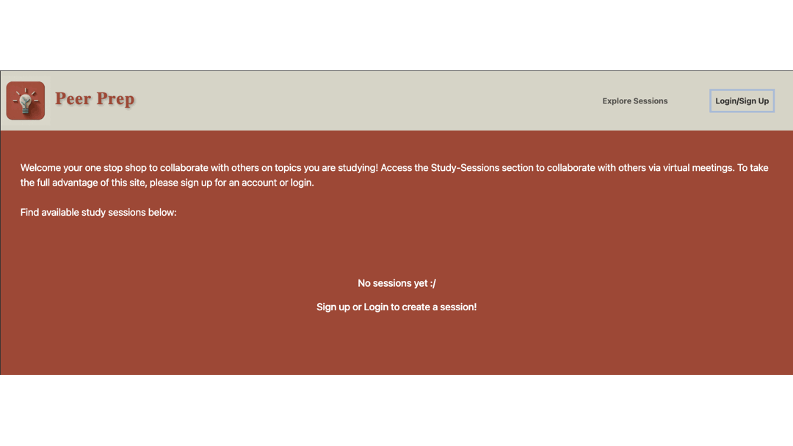
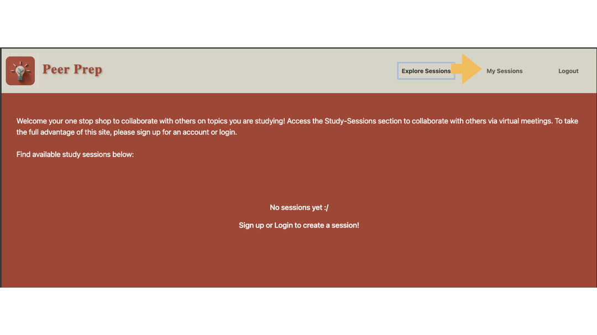
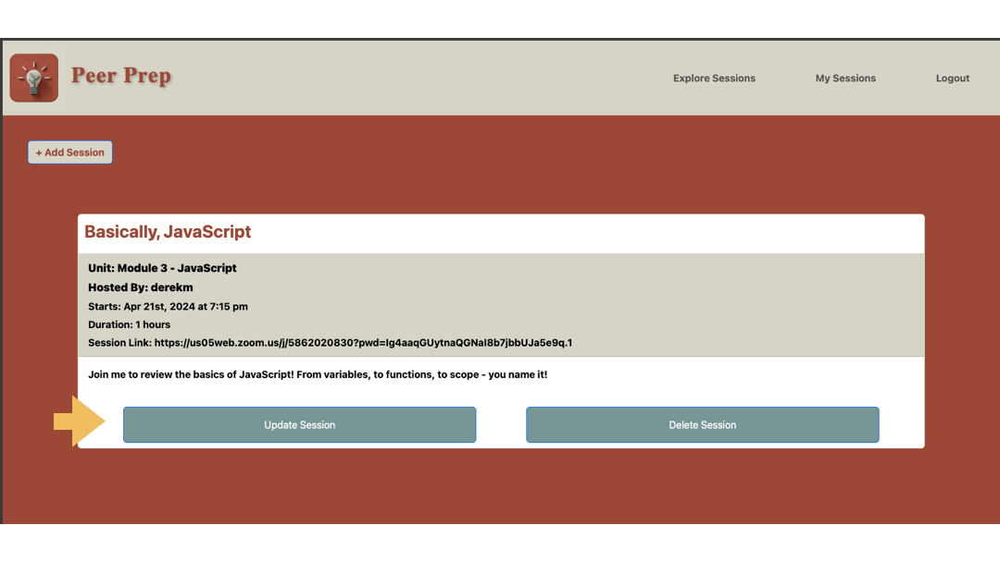
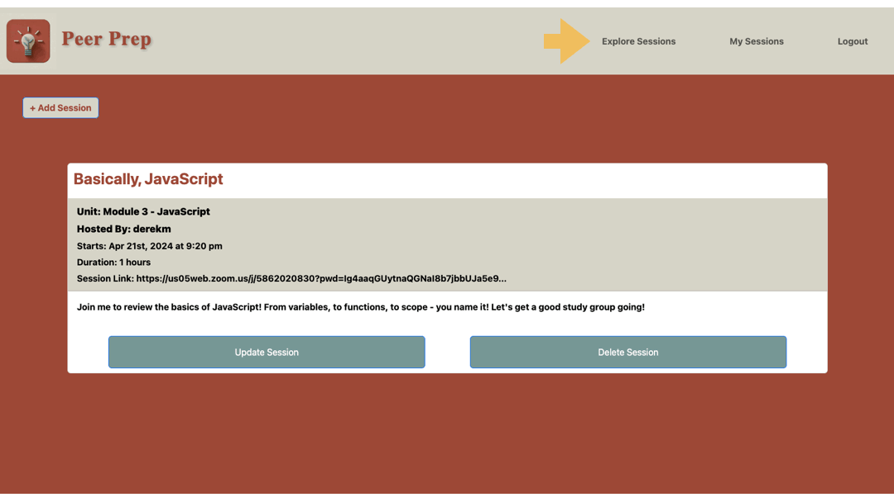

# Peer-Prep

## Description
Peer-Prep is an application tailored for aspiring developers seeking collaborative study groups to enhance their skills in coding and web development. The platform simplifies the organization of future study sessions by enabling users to create, explore, and register to sessions relevant to coding and web development topics. With Peer-Prep, users can seamlessly engage in a collaborative learning environment, fostering skill development and knowledge sharing among peers.  

This webtool was built using Apollo Server and the MERN stack - with React front end, MongoDB database, and Node.js/ Express.js server and API. 

## Table of Contents
- [Installation and Access](#installation-and-access)
- [Dependencies](#dependencies)
  - [Front End](#front-end)
  - [Back End](#back-end)
- [Usage](#usage)
  - [Logging in or Signing Up](#logging-in-or-signing-up)
  - [Creating a Session](#creating-a-session)
  - [Updating and Deleting a Session](#updating-and-deleting-a-session)
  - [Registering and Unregistering a Session](#registering-and-unregistering-a-session)
- [Testing](#testing)
- [Future Directions](#future-directions)
- [Contributing](#contributing)
- [License](#license)
- [Questions](#questions)

## Installation and Access
There is no installation necessary for this application as it is deployed using [Render](https://docs.render.com/). You can access and use the application [here](https://peer-prep.onrender.com/) or at the following link: https://peer-prep.onrender.com/

If you are interested in running the application locally, please use the following steps:
1. Clone this repository to your local machine. (For reference, visit the [Cloning a Repository](https://docs.github.com/en/repositories/creating-and-managing-repositories/cloning-a-repository) GitHub Docs article.)
2. Run `npm install && npm run build` in your CLI to download the npm package dependencies and build the app using vite.
3. Run `npm run develop` to start up the backend and serve the client.
4. Navigate to `http://localhost:3000` on your local web browser to use the application. 

## Dependencies
### Front End
This project requires the following npm package dependencies for the front-end client, which are included in the `client/package.json` file.

1. @apollo/client
2. bootstrap
3. dayjs
4. graphql
5. jwt-decode
6. react
7. react-bootstrap
8. react-dom
9. react-router-dom

### Back End
This project requires the following npm package dependencies for the back-end server, which are included in the `server/package.json` file.
1. @apollo/server
2. apollo-server-express
3. bcrypt
4. express
5. graphql
6. jest
7. jsonwebtoken
8. mongoose

## Usage 
### Logging in or Signing Up 

Upon launching the application, users will be presented the `ExploreSessions` page, where they can browse existing sessions. Users will not be given the option of registering for a session if they are not logged in. By pressing the `Login/ Sign Up` button in the navigation bar, a modal will appear for users to toggle between logging in and signing up. After doing so, an authentication token will be returned for the user so they may take full advantage of the webtool. 

### Creating a Session 

After logging in, the navigation bar will update to allow users to access the `MySessions` page. There, they can view the sessions that they've created or are registered to. Users will be presented with a button to `Add Session`, which will present them with a form to enter the details of the session they're hosting. An error message will appear if any of the fields are blank or have invalid inputs.

### Updating and Deleting a Session 

Once the user has created their own sessions, they will render in the `MySessions` page. While logged in, they will have the option to update or delete the sessions that they've created. Selecting `Update Session` will render a form so that they can make edits to the Session details. Selecting `Delete Session` will remove the session from the database and update the user and attendees' saved sessions.

### Registering and Unregistering a Session

When the user is browsing the `ExploreSession` page and see a session they're interested in, they'll have the option to register and save the session to their `MySessions` page if they are logged in. After doing so, the button will re-render and give the user the option to unregister from the session if they'd like. After registering for a session, the meeting link will render in the `MySessions` page. 

## Testing 
A testing suite was written with [jest](https://www.npmjs.com/package/jest) for the helper function `formatDate`. You may execute the test suite by running `npm run test` on the CLI while in the `server/` working directory. Note that the test suite was written based on PST/ PDT time zone.

The GraphQL queries and mutations were tested locally during development with the [Apollo Sandbox](https://www.apollographql.com/docs/graphos/explorer/sandbox/) studio tool.  

Please refer to the [Installation and Access](#installation-and-access) section if you are interested in running and testing the application locally.

## Future Directions 
- Implement a forum or Q&A page for users to post questions to their classmates
- Develop a commenting system to increase interactions with their classmates under posts and sessions
- Include payment integration with the Stripe payment platform to support charitable donations or premium features
- Add Progressive Web App (PWA) capabilities by building features such as a web manifest and service worker for offline functionality.

## Contributing
To make contributions to this project:  
1. Fork the repository  
2. Make some commits to improve the application
3. Open a Pull Request on GitHub
4. From there, we can discuss your changes and merge the pull request once your contributions have been approved!

## License 
This GitHub repository is licensed under the MIT license. Please refer to the license documentation [here](https://opensource.org/licenses/MIT).
  

## Questions
This project was developed by the following contributors: 
1. [dymoy](https://github.com/dymoy)
2. [ericlyn4s](https://github.com/ericlyn4s)
3. [jackrileynin](https://github.com/jackrileynin)
4. [mbullock710](https://github.com/mbullock710)

For any related questions, please contact me via email at <derekymoy@gmail.com>.
